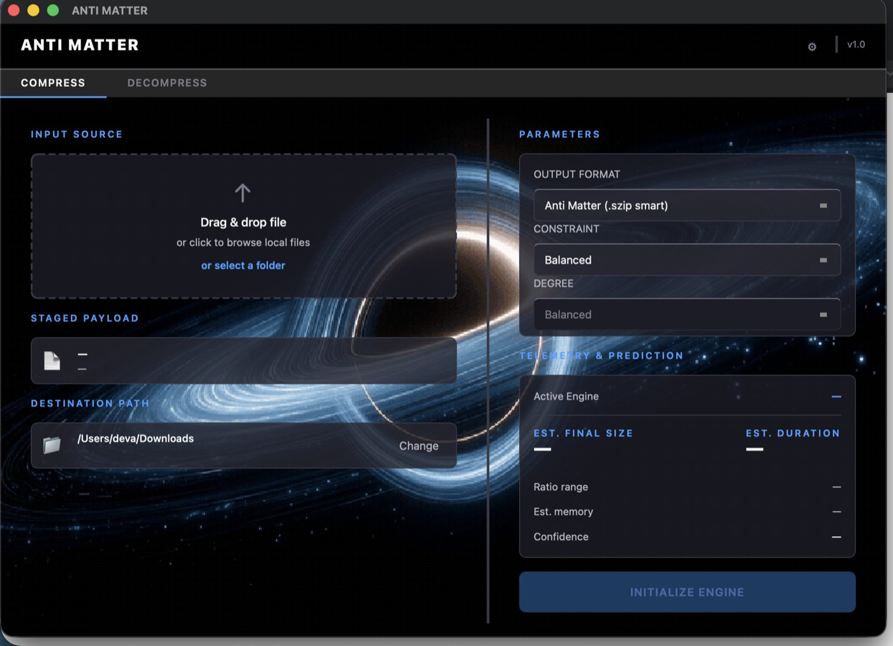
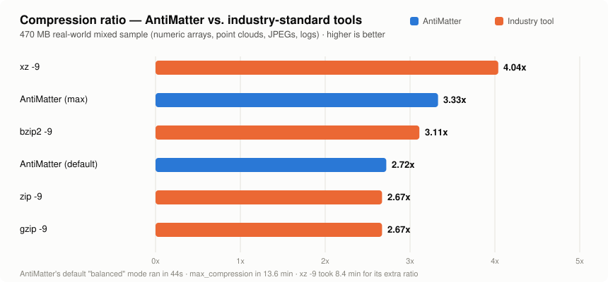

<div align="center">

# Anti Matter

**A compression tool that profiles your file before choosing how to compress it.**

Six engines, real per-file feature analysis, and a k-NN predictor over a benchmark database — instead of hardcoding "always use zstd-19," it picks the engine and level that actually fit *this* file and *your* constraint (max ratio, fastest decompress, lowest memory, ...).

[]()
[]()
[]()

</div>

<br>

<p align="center">
  
</p>

<br>

## Why

Every compression tool makes you pick an engine and a level up front, or hardcodes one and hopes for the best. Neither is right for a folder that mixes CSV exports, `.npy` arrays, point clouds, and JPEGs — each of those wants a different codec, and some (already-compressed images, high-entropy binary) don't want to be recompressed at all.

Anti Matter profiles each file (entropy, repetitiveness, numeric density, ASCII ratio), looks up the nearest neighbors in a benchmark database built from real compression runs, and picks the engine + level that best satisfies the constraint you asked for — with a size/time/confidence estimate shown *before* it runs.

## Features

- **6 compression engines**, one consistent interface: `zstd`, `lz4`, `gzip`, `lzma`, `brotli`, `bzip2`
- **Smart mode** — profiles the file, predicts outcomes for every engine/level, and picks the best fit for your constraint (`max_compression`, `balanced`, `fast_compression`, `fast_decompress`, `low_cpu`, `low_memory`) at one of 4 degrees (`normal` → `max`)
- **Force mode** — bypass the selector and pick an engine/level yourself
- **Folder archiving** (`.szip`) — walks a directory, picks the best engine *per file* (not one setting for the whole archive), skips recompressing already-compressed formats (JPEG, PNG, MP4, ...), and never lets an incompressible file balloon past its original size
- **Standard format support** — also emits plain `.zip`, `.tar.gz`, `.tar.bz2`, `.tar.xz` when you want a format other tools can open, no smart selection needed
- **Prediction + accuracy tracking** — every run shows an estimated ratio/time/confidence up front, then reports how close the estimate was after it finishes
- **Validator** — proves the selector's choices are actually good by running every engine/level combo and showing where the pick ranked
- **GUI + CLI** — a PySide6 desktop app for interactive use, a full CLI for scripting
- **Pure Python compression backends** (`zstandard`, `lz4`, `brotli`, stdlib `gzip`/`lzma`/`bz2`) — cross-platform, no bundled native binaries required to run from source

## Benchmark

Ran a 470 MB real-world mixed sample (numeric arrays, point clouds, JPEGs, log files) through every engine and compared against `zip`, `gzip`, `bzip2`, and `xz`:

<p align="center">
  
</p>

Anti Matter's engines track their underlying libraries honestly — its `gzip` wrapper lands within noise of the system `gzip -9` binary, no hidden overhead. The **`balanced`** default trades a modest ratio hit for a large speed win (44s vs. 8 min for `gzip -9`/`zip -9` on this sample), and **`max_compression`** beats `zip`, `gzip`, and `bzip2` outright, landing just under `xz -9`.

Verified losslessly on a real 9.9 GB / 16,179-file dataset — full round trip confirmed byte-identical via per-file SHA-256 checksums plus an independent spot check.

## Installation

```bash
git clone https://github.com/devapragadeesh/AntiMatter.git
cd AntiMatter
python3 -m venv .venv
source .venv/bin/activate      # Windows: .venv\Scripts\activate
pip install -r requirements.txt
```

Requires Python 3.10+. All 6 engines are pure-Python bindings (or stdlib), so this works the same on Windows, macOS, and Linux — no external compression binaries needed to run from source.

## Usage

All commands run from `src/`.

### Smart compression (recommended)

```bash
cd src

# no constraints — defaults to balanced
python -m antimatter.compressor path/to/file.xlsx

# pick a constraint + how aggressively to apply it
python -m antimatter.compressor path/to/file.sql  --constraint max_compression --degree high
python -m antimatter.compressor path/to/file.bin  --constraint fast_decompress --degree max
python -m antimatter.compressor path/to/file.xlsx --constraint low_memory      --degree normal

# blend multiple constraints
python -m antimatter.compressor path/to/file.xlsx --constraint max_compression --degree high --constraint low_memory --degree normal

# skip the confirmation prompt
python -m antimatter.compressor path/to/file.xlsx --constraint balanced --degree high --yes
```

### Force a specific engine

```bash
python -m antimatter.compressor path/to/file.xlsx --engine zstd  --level 9
python -m antimatter.compressor path/to/file.xlsx --engine brotli --level 11
python -m antimatter.compressor path/to/file.xlsx --engine bzip2 --level 9
```

### Decompress

```bash
# engine auto-detected from extension (.zst .lz4 .gz .lzma .br .bz2)
python -m antimatter.compressor path/to/file.xlsx.zst --decompress
python -m antimatter.compressor path/to/file.zst --decompress --output restored/
```

### Folders (`.szip` — smart per-file archive)

```bash
python -m antimatter.compressor path/to/folder --constraint balanced --output archive/
python -m antimatter.compressor path/to/folder.szip --decompress --output restored/
```

### Standard formats (when you need a `.zip`/`.tar.*` another tool can open)

```bash
python -m antimatter.compressor path/to/folder --format zip
python -m antimatter.compressor path/to/folder --format tar.xz
```

### GUI

```bash
python -m antimatter
```

### Validate the selector's choices

```bash
python ../legacy/validator.py path/to/file.xlsx --all_constraints
```

Shows every engine/level ranked by the same scoring the selector uses, and where the selector's actual pick landed — `OPTIMAL` (rank 1), `GOOD` (top 3), `ACCEPTABLE` (top 5), or `POOR`.

## Engines

| Engine | Levels | Extension | Notes |
|---|---|---|---|
| `zstd` | 1, 3, 6, 9, 12, 15, 19 | `.zst` | Best all-round speed/ratio balance |
| `lz4` | 1, 3, 6, 9, 12 | `.lz4` | Fastest option, modest ratio |
| `gzip` | 1, 3, 6, 9 | `.gz` | Universal compatibility |
| `lzma` | 1, 3, 5, 7, 9 | `.lzma` | High ratio, slow |
| `brotli` | 1, 4, 7, 9, 11 | `.br` | Strong on text/structured content |
| `bzip2` | 1, 3, 6, 9 | `.bz2` | BWT-based; often a fast, strong option on structured/numeric data |

## How it works

```
profiler.py   →  reads a sample of the file, extracts entropy / repetitiveness /
                  numeric density / ASCII ratio / a cheap zlib compressibility hint

selector.py   →  k-NN lookup against benchmark.db for files with a similar profile,
                  scored against your constraint's weight vector (ratio vs. speed
                  vs. memory), returns the best engine + level

predictor.py  →  turns the selector's neighbors into a concrete ratio / time /
                  memory / confidence estimate, calibrated to this machine's
                  measured throughput (calibration.py)

compressor.py →  runs the actual compression, then reports how close the
                  prediction was to what actually happened
```

`benchmark.db` is built by `legacy/chunker.py` (splits sample files into varied-size chunks) and `legacy/pipeline.py` (runs every engine × level on every chunk, writes the results). Both are resumable — safe to Ctrl+C and rerun.

## Project structure

```
src/antimatter/
├── profiler.py         file → feature vector (entropy, repetitiveness, ...)
├── runner.py            one engine+level → measured compression result
├── selector.py           k-NN engine/level recommendation from benchmark.db
├── predictor.py         detailed ratio/time/memory/confidence estimate
├── compressor.py        main CLI entry point — wires it all together
├── archiver.py           .szip folder archiving (per-file smart selection)
├── standard_formats.py  plain .zip / .tar.gz / .tar.bz2 / .tar.xz support
├── calibration.py       adjusts predicted speed to the local machine
├── paths.py              path resolution (source vs. frozen PyInstaller build)
├── main.py                GUI entry point
└── ui/                    PySide6 desktop app

legacy/
├── chunker.py            splits raw source files into benchmark chunks
├── pipeline.py            runs the full engine × level sweep → benchmark.db
└── validator.py           proves the selector's picks are actually good

data/
├── raw/                  original source files (never modified)
├── chunks/                generated by chunker.py
└── benchmark.db          generated by pipeline.py
```

## License

No license file is currently included in this repository.
